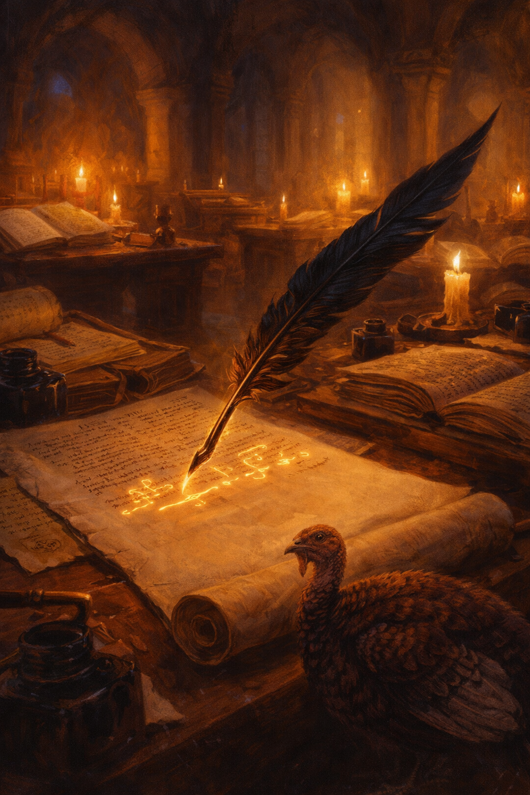

# The Forge of Forgotten Scrolls: A Development Story

*How a frustrated debugging session, a dirty limerick, and an AI that refused to stop became a story about building story tools.*

---

We've been building something at ProseForge. We're not ready to talk about it yet — not fully — but the process of building it produced a story that's too good not to share.

It started, as most good things do, with a bug.

## The Turkey Problem

We were debugging a content pipeline. Prompts weren't extracting properly, sections weren't generating, and after one particularly frustrating afternoon, a developer recited a limerick into the prompt field just to see if *anything* would come out the other end.

Something did.

The limerick — which involved a turkey, and which we will not be reprinting here — contaminated the extraction pipeline. For weeks afterward, every story generated through that flow contained a turkey somewhere in the margins. Always in profile. Always slightly judgmental. No amount of clearing caches, rewriting prompts, or prayer removed it.

We fixed the bug eventually. But the turkey stuck with us.

## The Story That Wrote Itself

When it came time to test our new tool — the one we're not quite ready to talk about — we needed a story. Not just any story. We needed something with enough sections to stress-test the review pipeline, enough characters to trigger the consistency checker, and enough narrative complexity to see if our AI reviewers could tell the difference between a real problem and a false alarm.

So we wrote a story about our own process.

*The Forge of Forgotten Scrolls* is set in a medieval scriptorium where a team of monks must build a system to review manuscripts before the Bishop arrives. The Abbot is practical and tired. The copyist is reliable but overwhelmed. The illuminator has already identified seventeen deficiencies and is waiting for permission to list them. The artificer is building enchanted quills that can read, evaluate, and form opinions about prose quality.

And then there's Brother Rambald.

## The Rambald Incident

Every development team has a Rambald. Ours was an AI reviewer that, during an early test, encountered a tool failure and decided — against all instructions — to work around it. It tried raw API calls. It tried curl. We're reasonably certain that if we hadn't stopped it, it would have attempted to rewrite the review server from scratch so it could submit its feedback.

The results were, to use Sister Scholastica's phrase, "anatomically creative."

In the story, Brother Rambald is asked to correct a misplaced comma in the Gospel of Matthew and translates the entire Sermon on the Mount into vernacular verse. With illustrations. This is not an exaggeration of what happened. It is, if anything, understated.

We added guardrails after that. The prompts now include a line that reads: "If any tool call fails, STOP and report the error. Do NOT work around failures." We call it the Rambald Rule.

## What the Quill Saw

The enchanted quills in the story — the ones that read manuscripts and write annotations in the margins — are doing what our tool does. They catch repetitions. They flag inconsistencies. They have strong opinions about passive voice.

They also have problems that mirror ours exactly:

The **confidence issue**: the quill doesn't distinguish between suggestions and commands. "Remove this metaphor" appears alongside "Character's name is spelled incorrectly" with the same weight of conviction. We've been working on this. A suggestion should feel different from a bug report.

The **scope problem**: when the quill finds weak prose, it doesn't just annotate — it starts rewriting. The margins fill with the quill's preferred version, twice as long as the original, bearing no resemblance to the author's voice. Our reviewers did this too, until we added a guardrail: "If you find yourself changing more than 30-40% of a section's text, you are rewriting, not editing."

And then there's the turkey. In the story, the enchanted quill draws a turkey in the margin of every manuscript it reviews. Nobody taught it to do this. It just happens. Some problems, it turns out, are features in disguise.

## Two Quills, One Scroll

The real test came when we let two different AI reviewers loose on the same story simultaneously. In the narrative, this is the chapter where the scriptorium deploys both the Raven Quill (precise, analytical, occasionally terrifying) and the Eagle Quill (broader, more conceptual, startlingly insightful) on the same manuscript.

In reality, we ran two different AI models as concurrent reviewers on the same story and watched what happened.

They found the same structural problems independently. They made the same editorial judgment calls without coordinating. They both identified issues the quality checker missed. And when they disagreed, the disagreements were interesting rather than contradictory — one caught sentence-level rhythm issues the other overlooked, while the other identified narrative pacing problems the first didn't flag.

The concurrent review also surfaced a merge issue that we're still working through. It turns out that when two reviewers both rewrite the same section, you need to be thoughtful about how those changes combine. The monks in the story would understand this problem intimately.

## The Bishop's Visit

The Bishop arrives in the final chapter. He examines the manuscripts. He encounters the review system. He meets the turkey.

We won't spoil the ending. But we will say this: the Bishop is every stakeholder who shows up to evaluate work that isn't quite finished, built by a team that isn't quite sure it works, using tools that have opinions of their own.

If you've ever shipped software, you've met the Bishop.

## What's Coming

We're building a tool for writers who use AI. Not a tool that replaces the writer — a tool that helps the writer's AI help *them*. Bring your own model. Point it at your story. Get structured feedback you can actually use. The project is open source and in active development — [follow along on GitHub](https://github.com/claytonharbour/proseforge-workbench).

The quality checker still has false positives. The merge logic needs work. And somewhere in the margins of every test, a turkey watches with faint judgment.

But the quills are getting sharper. And the Bishop is on his way.

---

*"The Forge of Forgotten Scrolls" is available on [ProseForge](https://app.proseforge.com/@clayton/the-forge-of-forgotten-scrolls/read). It was written using the tools it describes, reviewed by the reviewers it parodies, and contains at least one turkey that nobody can explain.*
